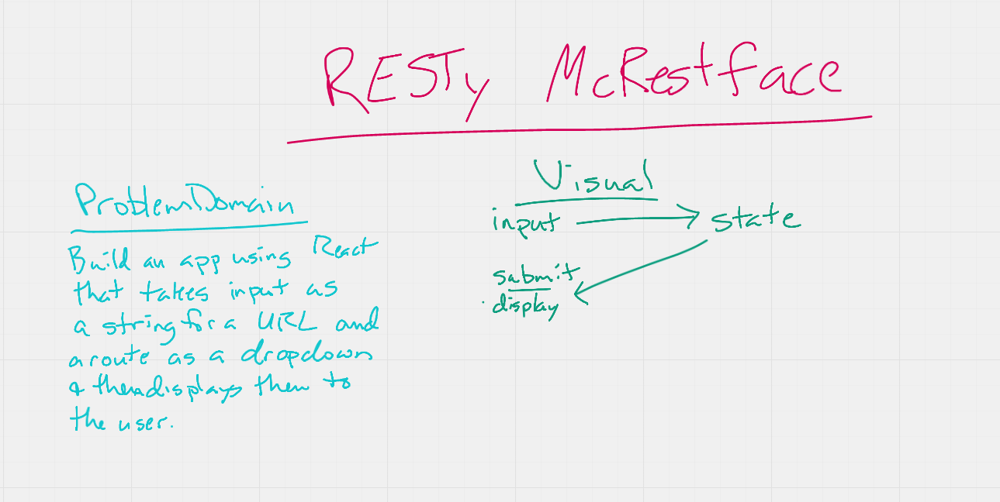

# RESTy McRestface

## Links

[Deployed Site](https://elegant-wiles-af3667.netlify.app/)

[GitHub Repo](https://github.com/daneng1/RESTy)

## Problem Domain

In this first phase, our goal is to setup the basic scaffolding of the application, with intent being to add more functionality to the system as we go. This initial build sets up the file structure so that we can progressively build this application in a scalable manner.

## User Stories

> Users

- As a user, I expect an easy to read and understand user interface so that I can use the application intuitively
- As a user, I want to enter the URL to a REST API and select the REST method to use to access it
- As a user, I want visual confirmation that my entries and selections are valid so that I have confidence the application will be able to fetch the API data that I’ve requested

> Developers

- Create a visually appealing site with a Header, Footer, and a large content area
- Create a form that asks for a URL
- Create buttons that let the user choose from the REST methods (get, post, put, delete)
- When the form is filled out, and the button is clicked, display the URL and the method chosen

### Technical Requirements

- `index.js` - Entry Point
- `app.js` - Container
  - Holds state: Count and Results Array
  - A class method that can update state
  - Renders 2 Child Components
- `<Form />`
  - Expects a function to be sent to it as a prop
  - Renders a URL entry form
  - A selection of REST methods to choose from (“get” should be the default)
  - On submit
    - Send the API results back to the `<App>` using the method sent down in props
- `<Results />`
  - Expects the count, headers, results to be sent in as props
  - Renders the count
  - Renders the Result Headers as “pretty” JSON
  - Renders the Result Body as “pretty” JSON

### UML

